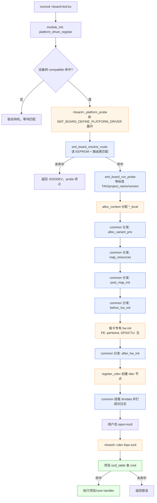
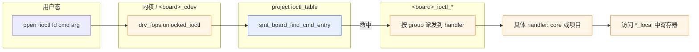
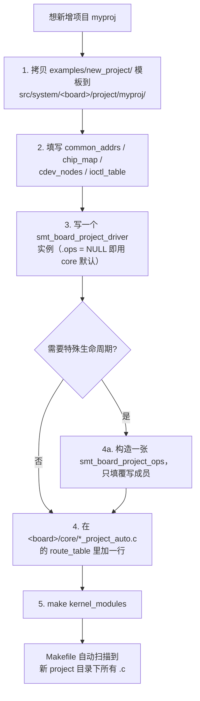
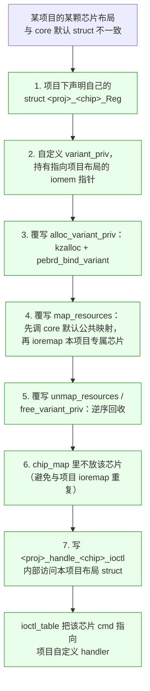

# Board 驱动端到端调用流程

该文档适用于 PE / DPS / CTU 三类板卡的统一驱动框架，一份即可解释三板的完整行为。其中各板卡自己才关心的细节（例如 PE 的 `peHwInit` 链路）会单独标注。

## 1. 目录分层回顾

```
src/system/
├── common/                       # 所有板卡共用
│   ├── board_common_addrs.h      # PL 公共映射窗口地址描述
│   ├── board_project_ops.h/.c    # 项目钩子类型 + 8 个分发函数
│   ├── board_project_auto.h      # platform_driver boilerplate 宏
│   ├── board_lifecycle.h/.c      # probe/remove 生命周期骨架
│   ├── board_autoprobe.h/.c      # EEPROM 读身份 + 路由匹配
│   ├── board_route.h/.c          # 路由表查表
│   ├── board_identity.h/.c       # EEPROM 数据结构
│   ├── board_cdev.h/.c           # /dev 节点创建/注销
│   ├── board_reg_map.h/.c        # ioremap 批量映射表驱动
│   ├── board_pl_transfer.h/.c    # PL 窗口读写 ioctl 包装
│   └── board_dispatch.h          # ioctl cmd 查表
├── <board>/core/                 # 同板卡所有项目共用
│   ├── <board>_project_auto.c    # 路由表 + 宏展开 platform_driver（probe/remove 直接调 common）
│   ├── <board>_main.c            # lifecycle_ops（对外 extern）+ 默认 8 钩子实现
│   ├── <board>_cdev.c            # 字符设备 fops
│   ├── <board>_mod.c             # core 常驻帮助函数
│   ├── <board>_ioctl_core.c      # core 级 ioctl handler
│   ├── <board>_ioctl_chip.c      # 芯片级 ioctl handler
│   ├── <board>_internal.h        # core 私有类型（*_local、寄存器模型）
│   └── ...
└── <board>/project/<project>/    # 板卡对应项目私有
    ├── <board>_project_<proj>.c  # 四张描述表 + driver 实例
    └── <proj>_<Board>A00.h       # 项目物理地址宏
```

## 2. 分层职责矩阵

| 关注点 | common | `<board>/core/` | `<board>/project/<project>/` |
|---|---|---|---|
| 路由匹配逻辑 | `smt_board_resolve_route` | - | - |
| 路由表内容 | - | `*_project_auto.c` 的 `*_route_table[]` | - |
| probe/remove 框架 | `smt_board_run_probe/remove`（统一日志） | 暴露 `extern lifecycle_ops` 即可，无需 wrapper | - |
| 项目钩子类型 | `struct smt_board_project_ops`（8 钩子） | - | - |
| 项目钩子分发 | `smt_board_project_call_*` | - | - |
| 板卡默认钩子实现 | - | `*_default_ops` | - |
| 项目钩子覆写 | - | - | 可选的 `smt_board_project_ops` |
| 资源映射 | `smt_board_ioremap_entries` | default map 调 common | 项目 `chip_map[]` 驱动 |
| 字符设备 | `smt_board_register_cdev_nodes` | 板卡 fops + 注册 | 项目 `cdev_nodes[]` |
| ioctl 分发 | `smt_board_find_cmd_entry` | `<board>_ioctl_*` 分发 | 项目 `ioctl_table[]` |
| ioctl handler 实现 | PL transfer 通用部分 | 具体芯片/core 命令 | 可选项目专用 handler |

## 3. 总体调用主线



颜色说明：蓝色=common 层、橙色=`<board>/core/`、绿色=`<board>/project/<project>/`。

## 4. 第一阶段：模块加载到路由选中

```mermaid
sequenceDiagram
    autonumber
    participant U as 用户态
    participant K as 内核平台总线
    participant A as &lt;board&gt;_project_auto.c<br/>（宏展开生成）
    participant CM as common
    participant C as &lt;board&gt;_core<br/>（lifecycle_ops）

    U->>K: insmod &lt;board&gt;brd.ko
    Note over K: module_init 展开自<br/>SMT_BOARD_DEFINE_PLATFORM_DRIVER
    K->>A: platform_driver_register
    Note over A: driver 注册完毕，<br/>等待 of_match 命中

    K-->>A: compatible 命中 -> &lt;board&gt;_platform_probe(pdev)
    A->>CM: smt_board_resolve_route(pdev, TAG, route_table, n, &result)
    CM->>CM: board_identity_load (读 EEPROM)
    CM->>CM: smt_board_find_route_payload(identity, table)
    alt 未命中
        CM-->>A: -ENODEV
        A-->>K: probe 失败
    else 命中
        CM-->>A: result.identity + result.payload (=project_desc)
        Note over A: 宏内联直接调 common：<br/>从 desc->driver 取出<br/>project_name/driver_version
        A->>CM: smt_board_run_probe(pdev, desc, &identity,<br/>&lt;board&gt;_lifecycle_ops,<br/>TAG, project_name, driver_version)
        CM->>C: 通过 lifecycle_ops 回调各阶段
    end
```

### 关键对象

| 对象 | 来源 | 内容 |
|---|---|---|
| `struct board_identity_info` | common EEPROM 读 | `project_id` / `board_type` / `board_hw_version` / 名称字符串 / eeprom_path |
| `struct smt_board_route_entry` | 板卡 `<board>/core/*_project_auto.c` | `project_id` + `board_type` + `hw_version` + `payload`（指向 project_desc） |
| `struct <board>_project_desc` | `<board>/project/<project>/*.c` | common_addrs / chip_map / cdev_nodes / ioctl_table / driver |
| `const struct smt_board_lifecycle_ops <board>_lifecycle_ops` | 板卡 `<board>/core/*_main.c` | 8 个生命周期回调 + `alloc_context/free_context`；由项目 auto.c 直接 `&`取地址传给 common |

## 5. 第二阶段：common 执行 lifecycle

不再有任何 `<board>_core_probe` 中间层——自动路由宏在拿到 `project_desc` 后直接调用 `smt_board_run_probe(pdev, desc, identity, &<board>_lifecycle_ops, TAG, project_name, driver_version)`。common 骨架按固定顺序回调板卡 `lifecycle_ops`，并统一打 probe 成功 / 失败日志。

```mermaid
sequenceDiagram
    autonumber
    participant A as &lt;board&gt;_project_auto.c<br/>（宏展开）
    participant L as common/board_lifecycle
    participant O as common/board_project_ops
    participant C as &lt;board&gt;_core<br/>（lifecycle_ops 回调）
    participant D as &lt;board&gt;_default_ops
    participant P as 项目 ops（可选）

    A->>L: smt_board_run_probe(pdev, desc, identity, lifecycle_ops, TAG, name, ver)
    Note over L: dev_info("<TAG> project probe: <name>")
    L->>C: lifecycle_ops.alloc_context -> 分配 *_local
    L->>C: alloc_context (&lt;board&gt;_local)
    Note over C: 分配 *_local，<br/>绑定 project_desc + board_identity

    L->>O: smt_board_project_call_alloc_variant_priv
    alt 项目 ops 有 alloc_variant_priv
        O->>P: 项目钩子
    else 项目未覆写
        O->>D: 板卡默认钩子
    end
    D-->>C: variant_priv 绑定完成（PE 走完整分配，DPS/CTU 为 no-op）

    L->>O: smt_board_project_call_map
    O->>D: map_resources（默认按 common_addrs + chip_map 映射）

    L->>O: smt_board_project_call_post_map_init
    O->>D: post_map_init（PE 初始化 mutex；DPS/CTU 打印 board descriptor）

    L->>O: smt_board_project_call_before_hw_init
    O->>D: before_hw_init（no-op 或项目扩展）

    Note over C: 板卡 core 自己在<br/>&lt;board&gt;_post_map_init 里<br/>夹一次真正的 hw init<br/>PE: peHwInit(lp, mask)<br/>DPS/CTU: 无
    C->>C: 硬件初始化（板卡相关）

    L->>O: smt_board_project_call_after_hw_init
    O->>D: after_hw_init（no-op 或项目扩展）

    L->>C: register_cdev
    C->>C: smt_board_register_cdev_nodes<br/>按 desc->cdev_nodes 建 /dev 节点

    L->>L: dev_set_drvdata(dev, *_local)
    Note over L: dev_info("<TAG> driver install succ<br/>project=.. eeprom=.. version=..")
    L-->>A: 返回 0（或失败时 dev_err 后返回错误码）
```

### 阶段分工

| 阶段 | common 负责 | `<board>/core/` 负责 | 项目可覆写？ |
|---|---|---|---|
| alloc_context | 调用 lifecycle_ops.alloc_context | 分配 `*_local`，填 pdev/project_desc/board_identity | 否（板卡框架） |
| alloc_variant_priv | 分发 | 默认实现（PE 有实际分配；DPS/CTU 空） | ✓ 项目 ops |
| map_resources | 分发 | 默认按 common_addrs + chip_map 映射 | ✓ 项目 ops |
| post_map_init | 分发 | 默认初始化 mutex / 打印 board desc | ✓ 项目 ops |
| before_hw_init | 分发 | 默认 no-op | ✓ 项目 ops |
| 真正 hw init | - | 板卡 core 直调（例如 PE 的 peHwInit） | 否（板卡固有流程） |
| after_hw_init | 分发 | 默认 no-op | ✓ 项目 ops |
| register_cdev | 调用 lifecycle_ops.register_cdev | 调 `smt_board_register_cdev_nodes` | 否（nodes 表来自项目） |

`before_remove` / `unmap_resources` / `free_variant_priv` 在 remove 路径上，以完全对称的顺序回调。

## 6. 第三阶段：运行态 ioctl 分发



每个项目持有自己的 `ioctl_table[]`，表项形如 `{ cmd, handler }`。common 提供 `smt_board_find_cmd_entry(table, count, entry_size, cmd)` 做按 cmd 查表。命中则调用表项 handler；handler 可能是 core 默认函数（例如 `pebrd_handle_tca6424_ioctl`），也可以是项目自己实现的函数。

## 7. 第四阶段：remove 对称回收

```mermaid
sequenceDiagram
    autonumber
    participant U as 用户态
    participant A as &lt;board&gt;_project_auto.c<br/>（宏展开）
    participant L as common/board_lifecycle
    participant O as common/board_project_ops
    participant C as &lt;board&gt;_core

    U->>A: rmmod -> module_exit -> platform_driver_unregister
    A->>L: &lt;board&gt;_platform_remove 直接调 smt_board_run_remove(pdev, &lt;board&gt;_lifecycle_ops)

    L->>O: smt_board_project_call_before_remove
    O->>C: before_remove 默认实现
    Note over C: DPS: dps_gpio_unbind_owner 等<br/>PE/CTU: no-op（除非项目覆写）

    L->>C: unregister_cdev (销毁 /dev 节点)
    L->>O: smt_board_project_call_unmap
    O->>C: unmap_resources 默认实现
    L->>O: smt_board_project_call_free_variant_priv
    O->>C: free_variant_priv 默认实现
    Note over C: kfree(*_local), 解绑 dev_drvdata
```

## 8. 新增项目最少步骤



详细模板见：
- `examples/new_project/pebrd_project.c.example`：最常见单实例项目
- `examples/new_project/pebrd_project_missing_chips.c.example`：裁掉部分芯片
- `examples/new_project/pebrd_project_multi_instance.c.example`：同类芯片多实例
- `examples/new_project/pebrd_project_chip_layout_diff.c.example`：**某颗芯片寄存器布局与 core 默认不一致**
- `examples/new_project/project_addr.h.example`：项目地址宏模板
- `examples/new_project/pebrd_route_entry.example`：路由表新增示例

## 9. 项目级芯片寄存器布局差异的标准做法

三板都采用"同板卡一个 ko 承载多个项目"的架构，`<board>_mod.h` 里的
`struct <chip>_Reg` 定义在 ko 级别唯一，不可能同时有两份。当某个项目
在 PL 上实现的同名芯片出现以下差异时，必须走"项目级覆写"这条路径：

| 差异类型 | 已解机制 | 是否需要覆写 handler |
|---|---|---|
| 基地址不同 | `common_addrs` + `chip_map[i].phy_addr` | 否 |
| 映射窗口大小不同 | `chip_map[i].map_size` | 否 |
| 芯片存在与否 | `chip_map` 裁剪 | 否 |
| **字段偏移 / padding 不同** | **无** | **是** |
| **多 / 少寄存器字段** | **无** | **是** |
| **字段语义 / 类型不同** | **无** | **是** |

### 覆写标准流程（7 步）



### 关键设计约束

- **core 的 `struct <chip>_Reg` 永远代表"默认 / 最多数项目使用"的布局**，不要为个别项目去改它。
- **项目自己的布局只存在于项目目录**（header + variant_priv + handler），对 core 和其他项目完全隔离。
- **chip_map 是"core 默认 map 的覆盖范围"**；凡是被项目 handler 接管的芯片，都应该从 chip_map 里删掉它的条目，避免双重 ioremap。
- **只有"受影响的那颗芯片" cmd 指向自定义 handler**；其他芯片仍走 core 默认 handler，不要把整个 ioctl_table 重写。

### 与其他变体的区别

| 场景 | 推荐 example | 关键差异点 |
|---|---|---|
| 缺少部分芯片 | `pebrd_project_missing_chips.c.example` | 只裁 chip_map + cdev_nodes + ioctl_table，**不**自定义 variant_priv |
| 同类芯片多实例 | `pebrd_project_multi_instance.c.example` | 自定义 variant_priv + 映射多个实例，**标准实例**挂回 chip_regs 让默认 handler 可用 |
| 某芯片布局不同 | `pebrd_project_chip_layout_diff.c.example` | 自定义 variant_priv + 项目专属 struct + **专属 handler 完全接管**（不挂回 chip_regs） |

## 10. 关键 common 入口与返回值速查

| 入口 | 何时调用 | 成功返回 | 失败返回 |
|---|---|---|---|
| `board_identity_load` | `smt_board_resolve_route` 内部 | 0 + 填充 `board_identity_info` | 负错误码（EEPROM 读失败等） |
| `smt_board_find_route_payload` | `smt_board_resolve_route` 内部 | 命中项的 `payload` 指针 | `NULL`（路由表无匹配） |
| `smt_board_resolve_route` | `<board>_platform_probe` | 0 + `route_result` 填好 | 负错误码（含 `-ENODEV`） |
| `smt_board_run_probe` | 由 `SMT_BOARD_DEFINE_PLATFORM_DRIVER` 展开的 `<board>_platform_probe` 直接调 | 0 + dev_drvdata 挂好 + 统一成功日志 | 负错误码（按阶段逆序回滚，统一失败日志） |
| `smt_board_project_call_map` 等 8 个 | lifecycle 适配点 | 项目或默认钩子的返回值 | 无注册时视为 0 / void |
| `smt_board_ioremap_entries` | 默认 map_resources | 0 + 批量填回 reg 指针 | 负错误码，内部已回滚已映射项 |
| `smt_board_register_cdev_nodes` | `register_cdev` | 0 + `/dev` 节点全部创建 | 负错误码，内部按已创建项回滚 |
| `smt_board_find_cmd_entry` | ioctl 分发 | 命中表项指针 | `NULL` |
| `smt_board_handle_pl_transfer` | PL ioctl 包装 | 0 + 读写完成 | 负错误码（见 `board_error.h`） |
| `smt_board_run_remove` | 由宏展开的 `<board>_platform_remove` 直接调 | 0 + 资源全部回收 | `-EINVAL`（ops 不完整等） |

## 11. 板卡差异速查

| 差异点 | PE | DPS | CTU |
|---|---|---|---|
| variant_priv 布局 | `pebrd_default_project_variant_priv`（core_regs + chip_regs） | 直接挂在 `*_local` | 直接挂在 `*_local` |
| alloc/free_variant_priv 默认行为 | 实际 alloc + bind | no-op | no-op |
| 有 peHwInit | 是（post_map_init 之后调） | 否 | 否 |
| post_map_init 默认内容 | 初始化 mutex | 初始化 mutex + bind GPIO owner + 打印 board desc | 初始化 mutex + 打印 board desc |
| before_remove 默认内容 | no-op | unbind GPIO owner | no-op |
| `*_local` 是否内置 cdev 数组 | `cdev[NUM_DEVICES]` | `cdev[10]` | `cdev`（单节点） |
| 设备树 compatible | `xlnx,axi-dma-test-1.00.a` | `xlnx,rds903-brd-1.00.a` | `xlnx,rds903-brd-1.00.a` |

---

## 附：进一步阅读

- `README.md`：分层原则与强制约束
- `pe/README.md`：PE 多项目 KO 的使用说明
- `pe/KO_LOAD_AND_IOCTL_FLOW.md`：PE 驱动历史版本的详细报告（已被本文档的 3、4、5 节涵盖，可作为 PE 专项背景资料）
